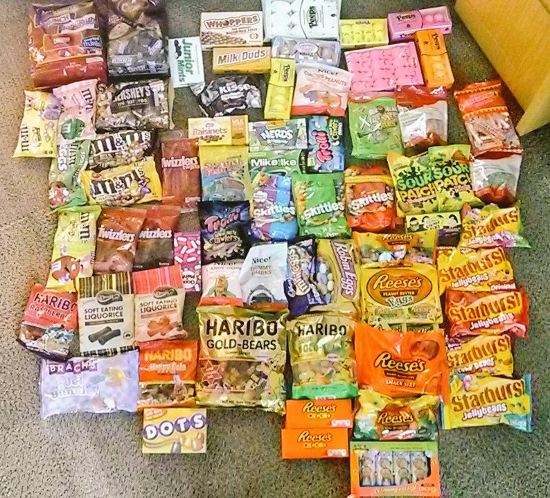

#Introducción

El objetivo de este documentos es servir de guía e introducción al análisis computacional de datos de fenotipo con R. Se elaboró para el seminario "", enmarcado en THE MENTORAC PROJECT - UMA en la Universidad de Málaga, a partir del un repositorio de Dan Chitwood and Chris Topp (Donald Danforth Plant Science Center, St. Louis). Es el primer bloque de ejerciocios prácticas del seminario que incluirá, más adelante, toma y análisis de imagen digital, y un reto para los alumnos.

Como ejemplo se usaran datos de chucherías (candy, empleando el set de datos original del citado repositorio.

#Sobre las chucherías

Efectivamente, chuches serán analizadas desde un punto de vista fenotípico durante este seminario. En el set de datos aparecen chuches que van desde chocolate hasta mantequilla de cacahuete a osos de gominola. Como prueba, se adjunta una imagen de los 75 tipos de chuches que serán analizados:



¿Qué se entiende como fenotipo? Lo usamos para hace referencia a todos los atributos de un organismo (o chuches en este caso). El fenotipo puede ser infinito: no solo es la suma de los atributos desde el nivel molecular al celular al organimos completo, pero que varía de forma plástica en respuesta a numerosos estímulos ambientales que el organismo puede recibir, y se manifiesta de forma dinámica a lo largo de la vida y el desarrollo de un organimos. Nunca obtendremos el fenotipo exacto de un organimos, ni de las chuces) pero intentaremos obtener tantos atributos como podamos (en este caso de los 75 tipos de chuches). Para este ejercicio de introducción se incluyen las etiquetas de valor alimencicio y composición de estas chuches, pero se podrían completar con más datos como color o forma.

#How does R work?

Si estás leyendo este documento en R, ya cuentas con una instalación de R. R es una plataforma libre (gratuíta y de código abierto) que permite a los usuarios usar "paquetes" (conjuntos de funciones y programas) para análisis especializados o para escribir tus propios programas y compartirlos con otros. Tiene términos y gramática propios que pueden resultar confusos y difícil al principio, pero una vez que los hayas dominado, te permitirá hacer análisis complejos y tareas repetitivas de una forma fácil y automatizada.

#Primer paso, importar los datos a R

Como no disponemos de mucho tiempo, iremos directos al análisis sin profundizar en lo que significa o implica cada detalle del código, pero os llevaréis una idea del potencial y la filosofía del análisis de datos con esta herramienta.

En cualquier caso real, lo primero que se hace es cargar (leer) tus datos en R. Estos datos pueden estar organizados en muchos formatos (vectores, matrices, listas...) pero en nuestro ejemplo tienen en formato de una tabla (dataframe) Cada fila es una observación y cada columna una variable. Las filas y columns tienen nombres a los que podemos hacer referencia para incluirlos en el análisis.

En primer lugar debemos decirle a R dónde encontrar los datos y qué hacer con ellos.

En este caso, usando RStudio como ayuda, habremos creado un proyecto y en la raíz de ese proyecto encontraremos este documento y la tabla con los datos "candy_nutrition.txt". Si en la pestaña de archivos puedes ver ese documento, perfecto.

Este archivo con datos está salvado como un documento delimitado por tabulaciones (cada columna está separada de las anterior y siguiente por una tabulación). Para leer los datos usaremos la función `read.table()` Uno de los argumentos, `header`, le diche a R que se va a encontrar nombres de columnas, que están presentes en la primera fila de nuestros datos, por lo que este argumentos lo estableceremos como verdadero, `TRUE`, como se ve a continuación:

```{r}
data <- read.table("./candy_nutrition.txt", header=TRUE)
```

Acabamos de crear un objetivo `data`, al asignar los datos que hemos leído mediante el símbolo `<-`.  Significa que "para la salida de la función `read.table()`, crea un objeto con ese nombre y pon dentro los datos que acabamos de leer". Ahora, los datos están accesibles en R dentor del objetio `data`. Podríamos haber llamado a este objeto de cualquier forma, `pepe_data`, `ana_data`, `datos_chuches`...

Genial! Ya tenemos datos, ahora veamos cómo podemos trabajar con ellos.

#Comprobando los datos

Lo primero que debes hacer tras leer los datos en R es comprobar que se han importado correctamente.

Usaremos la función `names()` para ver los nombres de la columnas (variables) de nuestros datos.

```{r}
names(data)
```

Nos dice que la primera columna es `id`, la segunda `name`, la tercera `company`, etc.

He usado el nombre original en inglés. A continuación una breve descripción de lo que es cada variable:

* `id`: un identificador único de cada tipo de cuche
* `name`: el nombre comercial de la chuche
* `company`: la compañía que fabrica la chuche
* `class`: el tipo o clase general
* `serving_size_g`: el tamaño de la ración en gramos
* `calories`: calorías por ración
* `calories_fat`: calorías procedentes de la grasa
* `total_fat_g`: el total de grasas en gramos
* `saturated_fat_g`: las grasas saturadas en gramos
* `cholesterol_mg`: colesterol en miligramos
* `sodium_mg`: sal (NaCl) en miligramos
* `total_carb_g`: carbohidratos totales en gramos
* `dietary fiber`: fibra alimentaria
* `sugars`: azucar en gramos
* `primary ingredient`: el primer ingrediente (el más abundante) de la etiqueta

Usaremos ahora la función `head()` para ver las primeras 10 líneas de nuestros datos:

```{r}
head(data, n=10)
```

Para ver las últimas líneas usaremos `tail()`:

```{r}
tail(data)
```

Entre las funciones más interesantes tenemos `summary()`. Nos resume toda la tabla de datos:

```{r}
summary(data)
```

Algunas columnas, como `id`, `name`, `company`, `class`, y `primary_ingredient`, indican cuántos términos diferentes hay. Otras, como `calories` y `total_fat_g`, muestran el mínimo, máximo, media, mediana y los cuartiles. Las variables en R serán o bien "factores" o bien "numericas". Básicamente, estas son variables categoricas o numéricas contínuas. 

#Visualización de datos con ggplot2

Primero debemos cargar el paquete ggplot2.

```{r}
library(ggplot2)
```

Una vez cargado podemos usar las funciones que están definidas en este paquete. 

Para saber más sobre `ggplot2`, puedes consultar la magnífica [documentación](http://docs.ggplot2.org/current/).  

¡Hagamos nuestra primera gráfica!

```{r}
p <- ggplot(data=data, aes(x=sugars_g))

p + geom_histogram() + 

ggtitle(label="Bravo! ¡Hiciste tu primera figura con ggplot2!")
```

Podemos jugar un poco con las funcions de `ggplot2` y explorar sus posibilidades. La figura anterior es un histograma y mustra la distribución de valores para un carácter, en este caso `sugars_g`. La función `ggplot()` tiene una disposición por capas: en un objetio llamado `p` creado por la función `ggplot()` se especifican los datos, y después las variables usadas para la figura mediante otra función, `aes()`, que proviene de "aesthetics". En el caso anterior especificamos que x sea la variable `sugars_g`. Una vez creado el objeto `p`, podemos añadir "geom"s" que son básicamente tipos de gráficas. `geom_histogram()` crea un histograma. Hay muchas otras opciones com  `ggtitle()` que añade un título.

Podmeos usar los atributos `fill` y `colour` en la función `aes()`.  Por ejemplo, añadamos `fill=company` a la figura anterior.

```{r}
p <- ggplot(data=data, aes(x=sugars_g, fill=company))

p + geom_histogram()
```

Podemos controlar el esquema de color usando las funciones `scale_fill` o `scale_colour`. Reagamos nuestro histograma por el tipo de chuche, para las que hay 7 tipos diferentes. Podmeos especificar los colores por nombre "[name](http://www.stat.columbia.edu/~tzheng/files/Rcolor.pdf)". El orden de los niveles establecerá el orden de los colores. En la clase caracter el orden es alfabético:

```{r}
summary(data$class)
```

Tratemos de asignarle el color según el tipo:

```{r}
p <- ggplot(data=data, aes(x=sugars_g, fill=class))

p + geom_histogram() + 

scale_fill_manual(values=c("tan4","lawngreen","firebrick1","black","darkorange","yellow","cadetblue1"))
```

Si no nos gusta la paleta d ecolores, podemos usar paletas más elaboradas, como las incluídas en la web [color brewer](http://colorbrewer2.org/), usando la función `scale_fill_brewer()`.

```{r}
p <- ggplot(data=data, aes(x=sugars_g, fill=class))

p + geom_histogram() + 

scale_fill_brewer(type="qual", palette=1)
```

Podemos manipular otros aspectos de la gráfica usando la función `theme()`. Para empezar, definiremos todas estas características como vacías:

```{r}
p <- ggplot(data=data, aes(x=sugars_g, fill=class))

p + geom_histogram() + 

scale_fill_brewer(type="qual", palette=1) +
theme(axis.line=element_blank(),
      axis.text.x=element_blank(),
      axis.text.y=element_blank(),
      axis.ticks=element_blank(),
      axis.title.x=element_blank(),
      axis.title.y=element_blank(),
      legend.position="none",
      panel.background=element_blank(),
      panel.border=element_blank(),
      panel.grid.major=element_blank(),
      panel.grid.minor=element_blank(),
      plot.background=element_blank())
```
      
¡Nadie quiere *nothing* en su gráfica! Vamos a añadir tan solo títulos para los ejes usando `xlab()` y `ylab()` y vamos a quitar el fondo gris con `theme_bw()`. Fijáos también en el cambioi del título de la leyenda y que hemos puesto el título en dos líneas con la función `ggtitle` y `\n`, que crea una nueva línea.

```{r}
p <- ggplot(data=data, aes(x=sugars_g, fill=class))

p + geom_histogram() + 

scale_fill_brewer(type="qual", palette=1, name="Classes of candy") + 
xlab(label="Sugar in grams") + 
ylab(label="Count") + 
ggtitle("A histogram of sugar content in grams\nfor candies of different classes") + 
theme_bw()
```

Ahora vamos a probar otros tipos de figuras, como los diagramas de dispersión. Fijáos en el uso de `size` y `alpha` para los puntos (`alpha` indica transparencia, donde "1" es opaco).

```{r}
p <- ggplot(data=data, aes(x=total_carb_g, y=sugars_g, colour=class))

p + geom_point(size=4, alpha=0.7) + 

scale_fill_brewer(type="qual", palette=1, name="Classes of candy") + 
xlab(label="Total carbohydrates in grams") + 
ylab(label="Sugars in grams") + 
ggtitle("Sugars vs. total carbohydrates") + 
theme_bw()
```

Estaría bien conocer la identida de cada chuche en esta figura. Y si dos chuches se superponen, ¿no sería mejor poder ver ambos nombres? Instalaremos el paquete `ggrepel` para poder usar la función `geom_repel_text`

```{r, eval=FALSE}
install.packages("ggrepel")
```
```{r}
library(ggrepel)
```
Y volvemos a hacer la figura usando la función `geom_text_repel`: 

```{r}
p <- ggplot(data=data, aes(x=total_carb_g, y=sugars_g, colour=class))

p + geom_point(size=4, alpha=0.7) + 

geom_text_repel(data=data, aes(x=total_carb_g, y=sugars_g, label=name)) + 
scale_fill_brewer(type="qual", palette=1, name="Classes of candy") + 
xlab(label="Total carbohydrates in grams") + 
ylab(label="Sugars in grams") + 
ggtitle("Sugars vs. total carbohydrates") + 
theme_bw()
```

Un último tipo de gráfica, la caja y bigotes o boxplot.

```{r}
p <- ggplot(data=data, aes(x=class, y=total_carb_g, colour=class, fill=class))

p + geom_boxplot(alpha=0.5) + 

scale_fill_brewer(type="qual", palette=1, name="Classes of candy") + 
scale_colour_brewer(type="qual", palette=1, name="Classes of candy") + 
xlab(label="Class of candy") + 
ylab(label="Total carbohydrates in grams") + 
ggtitle("Boxplot of total carbs colored by candy class") + 
theme_bw() + 
theme(axis.text.x=element_text(angle=90))
```

La habilidad crear buenas visualizaciones está en el corazón de la exploración de datos y de poder conocer tus datos. Las habilidades que habéis puesto en práctica con este módulo se podrán usar en el siguiente módulo de este seminario, análisis de imágen, o en cualquier otro estudio que requiera manejar datos.